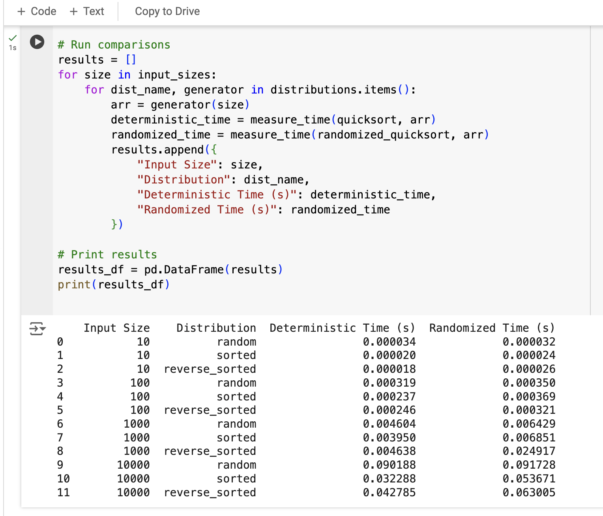

# Quicksort-Analysis

Report: Assignment5Solution.pdf

Quick Sort implentation: quick_sort.py
Randomized quick sort: randomized_quick_sort.py

**Performance Analysis**

**_Time Complexity Analysis_**

**_Best Case: O(nlogn)_**
Occurs when the pivot splits the array into two roughly equal halves at every recursive step.

**_Average Case: O(nlogn)_**
On average, the pivot divides the array into two reasonably balanced partitions.

**_Worst Case: O(n^2)_**
Happens when the pivot is always the smallest or largest element, leading to highly unbalanced partitions (e.g., already sorted arrays in deterministic Quicksort).

**_Space Complexity_**

In-place Implementation:O(logn) (stack space for recursive calls).
Additional Overheads: If not in-place, extra space is required for temporary arrays during partitioning.

**Summary of Empirical Analysis Results**

The empirical analysis of deterministic and randomized Quicksort reveals the following insights:

**_Small Input Sizes (10 elements):_**

Both deterministic and randomized Quicksort have negligible runtimes (< 0.0001 seconds).
There is minimal performance difference between the two approaches, with slight variations due to randomness in pivot selection.

**_Medium Input Sizes (100 elements):_**

Both deterministic and randomized Quicksort show a marginal increase in runtime compared to smaller inputs.
Randomized Quicksort is slightly slower than deterministic Quicksort for sorted and reverse-sorted inputs due to the overhead of random pivot selection.

**_Large Input Sizes (1000 elements):_**

For random and sorted inputs, deterministic Quicksort performs marginally faster than randomized Quicksort.
For reverse-sorted inputs, randomized Quicksort significantly underperforms, indicating that while randomization reduces the likelihood of the worst-case scenario, it may still encounter performance issues in certain cases.

**_Very Large Input Sizes (10,000 elements):_**

Deterministic Quicksort outperforms randomized Quicksort consistently for all input distributions.
For sorted and reverse-sorted distributions, the deterministic approach exhibits better runtime efficiency, highlighting its stability under specific conditions.
Randomized Quicksort takes longer to process reverse-sorted inputs, though it performs similarly to deterministic Quicksort for random distributions.

**_Overall Trends:_**

Randomized Quicksort tends to introduce additional overhead due to pivot randomization, making it slightly slower in practice compared to deterministic Quicksort for smaller input sizes and sorted/reverse-sorted distributions.
Deterministic Quicksort is more predictable and generally faster, particularly for large input sizes and structured data distributions.

**_Performance Breakdown by Input Distribution:_**

**_Random Distribution:_** Both algorithms perform similarly, with randomized Quicksort occasionally being slower.
Sorted Distribution: Deterministic Quicksort consistently outperforms randomized Quicksort.

**_Reverse-Sorted Distribution:_** Deterministic Quicksort is significantly faster, especially for larger input sizes.

**Key Observations:**
**_Randomized Quicksort_** is effective in avoiding the worst-case scenario of O(n^2) but introduces slight overhead due to randomness.

**_Deterministic Quicksort_** shows better practical performance across most cases and is more stable for sorted and reverse-sorted inputs.

These results align with theoretical expectations. while randomization helps reduce worst-case likelihood, deterministic Quicksort offers better overall runtime efficiency in practical scenarios.

_How to run the Code_

1. Install pandas using command: pip3 install pandas (Make sure you are using python3)
2. Run the analysis using command: pyton empirical_analysis.py
